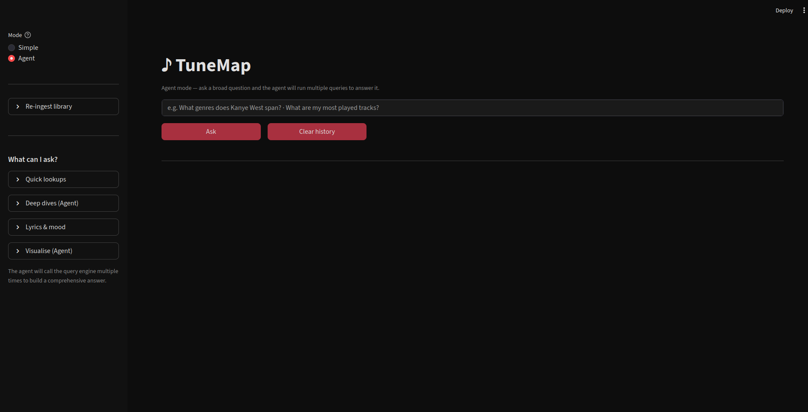
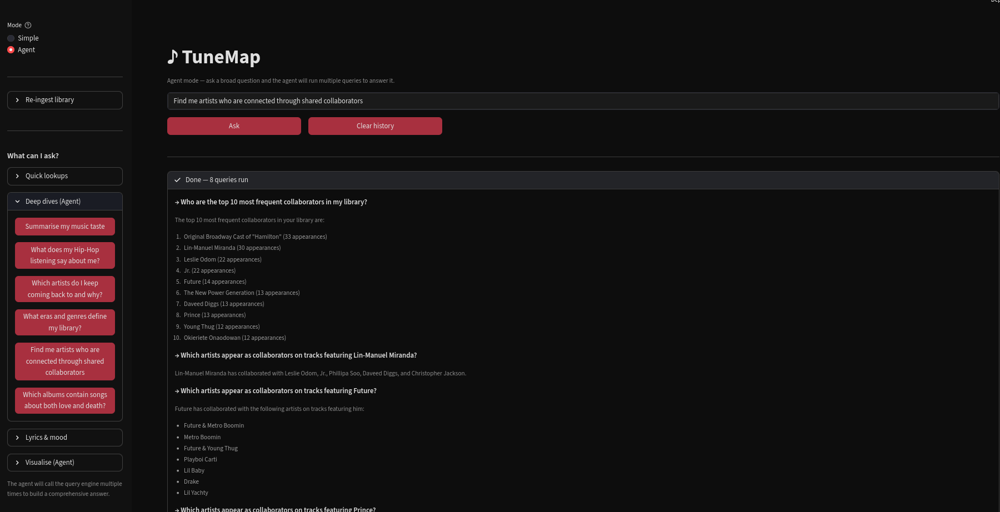
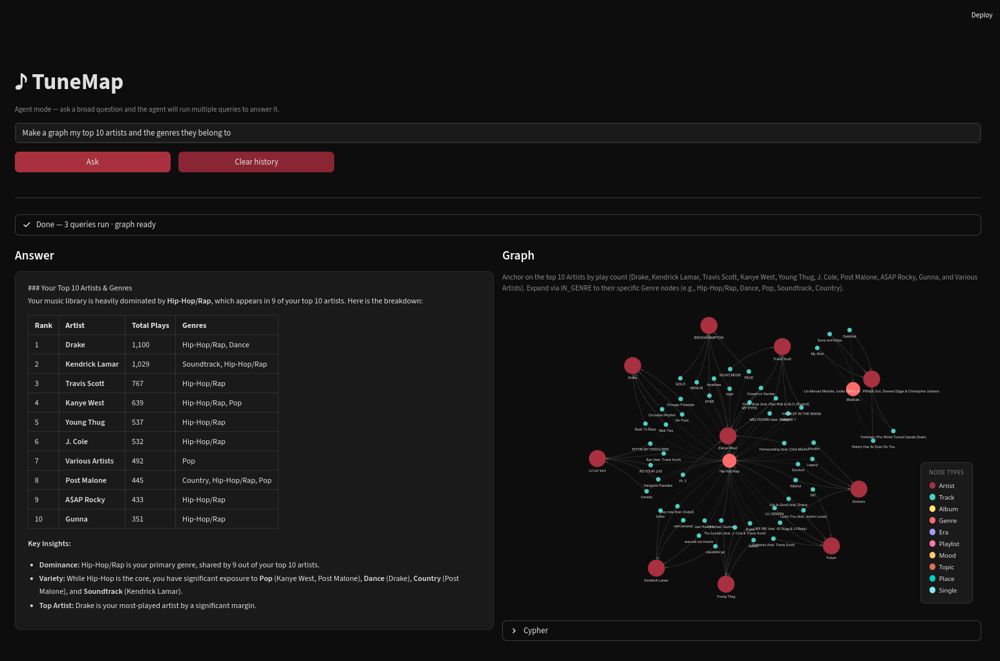
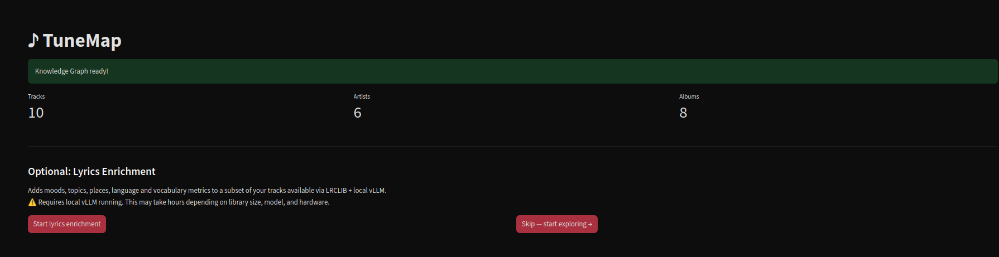
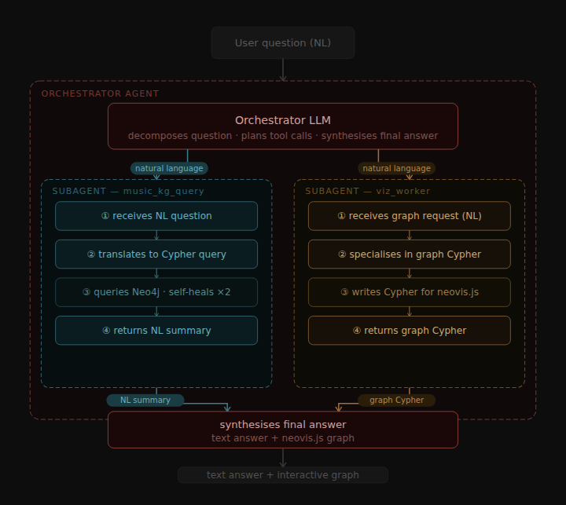

# TuneMap

Transform your Apple Music library into a queryable Knowledge Graph. Ask questions in plain English — get natural language answers and an interactive graph visualisation of the exact subgraph behind the answer.


<figure>
  
  <figcaption><i>Entry screen after Library is dropped in and ingested.</i></figcaption>
</figure>


### Agent Mode - Run multiple querreis, get comprehensive picture

The agent mode allows a model (with thinking enabled) to understand what the user is specifically, and deconstruct it into targetted natural language questions, The fact that the model only asks NL questions and receives NL answers makes it significantly better at a coherent report, this is especially relevant for Local Ai, where thte models are more limited. This separation of concerns is also pwoerful for our two other agents, which are simply instructed to od Text2Cypher or Text2NeoVisGraph.


<figure>
  
  <figcaption><i>Agent Mode: Asking multiple querries</i></figcaption>
</figure>


<figure>
  
  <figcaption><i>Agent Mode: Return graph if appropriate</i></figcaption>
</figure>


### Lyrics Mining Pipeline

Whilst the data from Apple Music is quite rich with skip and play counts, genres etc., we do not anything concrete on the content of the songs. Thus, an optional step is added in a pipeline that uses a Free API to get song lyrics, which are then mined by the connected LLM for : 1) Locations mentioned, 2) Moods, 3) Topics. Additionally, we also extract some statistics like lyric diversity and langauge through traditional NLP techniques.


<figure>
  
  <figcaption><i>Option to Start Lyric Enrichment in the background</i></figcaption>
</figure>


## Archiecture:




---

## Prerequisites

- **Python 3.12+** (for running locally without Docker)
- **Neo4j 5** — [download](https://neo4j.com/download/) or run via Docker
- **An LLM backend** — one of:
  - Local vLLM (GPU recommended, 16 GB+ VRAM for the default model)
  - OpenAI API key

---

## Quick Start

### Option 1 — Docker (recommended)

**No GPU / OpenAI or external vLLM backend:**
```bash
cp .env.example .env
# fill in NEO4J_PASSWORD and OPENAI_API_KEY (or VLLM_BASE_URL for external vLLM)
docker compose up --build
```

**Full GPU stack (vLLM inside Docker):**
```bash
cp .env.example .env
# fill in NEO4J_PASSWORD, HF_TOKEN, and optionally VLLM_HF_MODEL
docker compose -f docker-compose.gpu.yml up --build
```
> Requires [NVIDIA Container Toolkit](https://docs.nvidia.com/datacenter/cloud-native/container-toolkit/install-guide.html) installed on the host.

Then open `http://localhost:8501` and **follow the onboarding** to upload your `Library.xml`.

---

### Option 2 — Local (native)

```bash
git clone <repo>
cd TuneMap
python -m venv .venv && source .venv/bin/activate
pip install -r requirements.txt

cp .env.example .env
# fill in .env (see Configuration below)
```

Start Neo4j, then:
```bash
streamlit run app.py
```

---

## Exporting Your Apple Music Library

In Apple Music (macOS): **File → Library → Export Library…**

Save the resulting `Library.xml` anywhere — you'll upload it through the app's onboarding screen on first launch. The app handles all parsing and ingestion from there.

---

## Configuration

Copy `.env.example` to `.env` and fill in the relevant section for your setup:

```env
# Neo4j
NEO4J_URI=bolt://localhost:7687
NEO4J_USER=neo4j
NEO4J_PASSWORD=your_password

# vLLM (local native or Docker)
VLLM_BASE_URL=http://localhost:8000/v1
VLLM_MODEL=qwen3.5-9b-awq

# OpenAI (alternative to vLLM)
# LLM_PROVIDER=openai
# OPENAI_API_KEY=sk-...
# OPENAI_MODEL=gpt-4o
```

See `.env.example` for the full reference including all vLLM Docker options.

---

## Running vLLM Locally (native)

```bash
vllm serve QuantTrio/Qwen3.5-9B-AWQ \
  --served-model-name qwen3.5-9b-awq \
  --quantization awq_marlin \
  --enable-auto-tool-choice \
  --tool-call-parser qwen3_coder \
  --reasoning-parser qwen3 \
  --gpu-memory-utilization 0.90 \
  --max-num-seqs 1 \
  --port 8000
```

Any OpenAI-compatible endpoint works — swap in a different model by updating `VLLM_MODEL` in `.env`.

---

## Codebase Architecture

```
Library.xml (Apple Music export)
        ↓
parse_library.py        → library.json
        ↓
ingest_graph.py         → Neo4j Knowledge Graph
        ↓
┌─────────────────────────────────────────────────────────────────┐
│                     TuneMap (Streamlit)                         │
│                                                                 │
│  User question (natural language)                               │
│         ↓                                                       │
│  ┌─────────────────┐      ┌──────────────────────────────────┐  │
│  │   Simple mode   │      │          Agent mode              │  │
│  │                 │      │                                  │  │
│  │  TextToCypher   │      │  Tool-calling loop (OpenAI API)  │  │
│  │  Retriever      │      │  ┌──────────────────────────┐   │  │
│  │  + self-healing │      │  │ music_kg_query tool       │   │  │
│  │  retry (×2)     │      │  │  → TextToCypher + Neo4j  │   │  │
│  │         ↓       │      │  │  → self-healing retry    │   │  │
│  │  Neo4j query    │      │  │  (up to 8 steps)         │   │  │
│  │         ↓       │      │  └──────────────────────────┘   │  │
│  │  LLM summarises │      │  ┌──────────────────────────┐   │  │
│  │  → text answer  │      │  │ render_graph tool         │   │  │
│  └─────────────────┘      │  │  → viz_worker LLM call   │   │  │
│                            │  │  → Cypher for neovis.js  │   │  │
│                            │  └──────────────────────────┘   │  │
│                            │  LLM synthesises final answer    │  │
│                            └──────────────────────────────────┘  │
│         ↓                               ↓                       │
│   Text answer                  Text answer + neovis.js graph    │
└─────────────────────────────────────────────────────────────────┘
```

**Simple mode** — one direct Cypher query with self-healing retry, fast answer, no graph.


**Agent mode** — LLM autonomously calls `music_kg_query` up to 8 times to gather data, optionally calls `render_graph` to produce a neovis.js subgraph, then synthesises a comprehensive answer.

---

## Knowledge Graph Schema

```
(:Track)-[:BY]------------->(:Artist)       primary artist
(:Track)-[:FEATURES]------->(:Artist)       featured artists
(:Track)-[:ON]------------->(:Album)        album tracks only
(:Track)-[:IS_SINGLE]------>(:Single)       standalone singles
(:Track)-[:IN_GENRE]------->(:Genre)
(:Track)-[:IN_ERA]--------->(:Era)
(:Track)-[:IN_PLAYLIST]---->(:Playlist)
(:Album)-[:BY]------------->(:Artist)
(:Artist)-[:IN_GENRE]------>(:Genre)        derived, weighted by track count
```

**Track properties:** `name`, `year`, `release_date`, `duration_ms`, `play_count`, `skip_count`, `loved`, `explicit`, `date_added`, `track_number`

---

## Lyrics Enrichment (optional)

After the initial graph is built, the app offers an optional enrichment step that fetches lyrics via [LRCLIB](https://lrclib.net) and uses the LLM to extract moods, topics, places, and vocabulary metrics — adding these as graph nodes and track properties.


> Requires local vLLM running. Duration depends on library size, model, and hardware.

**Additional schema nodes added by enrichment:**
```
(:Track)-[:HAS_MOOD]-------->(:Mood)
(:Track)-[:HAS_TOPIC]------->(:Topic)
(:Track)-[:MENTIONS_PLACE]-->(:Place)
```

**Additional track properties added by enrichment:** `lyrics_found`, `language` (ISO 639-1), `total_words`, `unique_words`, `type_token_ratio`, `repetition_rate`

---

## Tech Stack

| Layer | Tool |
|---|---|
| Data parsing | Python (`plistlib`) |
| Graph database | Neo4j 5 |
| Graph visualisation | neovis.js |
| Text-to-Cypher | LlamaIndex `TextToCypherRetriever` + self-healing retry |
| Agent loop | OpenAI-compatible tool-calling API (multi-step) |
| Graph viz generation | Dedicated `viz_worker` LLM call (separate from agent) |
| LLM inference | vLLM (local) or OpenAI API |
| Default model | Qwen3.5-9B-AWQ |
| App framework | Streamlit |

---

## Why Graph over SQL?

A flat SQL table handles aggregation queries fine. The graph earns its keep for:

- **Path finding** — "What connects artist X and artist Y?" requires recursive joins in SQL, one line in Cypher
- **Variable-depth traversal** — "Find artists within 2 hops of my taste profile" is natural in Cypher
- **Subgraph visualisation** — query results are already a graph structure, making neovis.js a natural output
- **Extensibility** — adding external data (collaborations, audio features) fits without schema migrations
